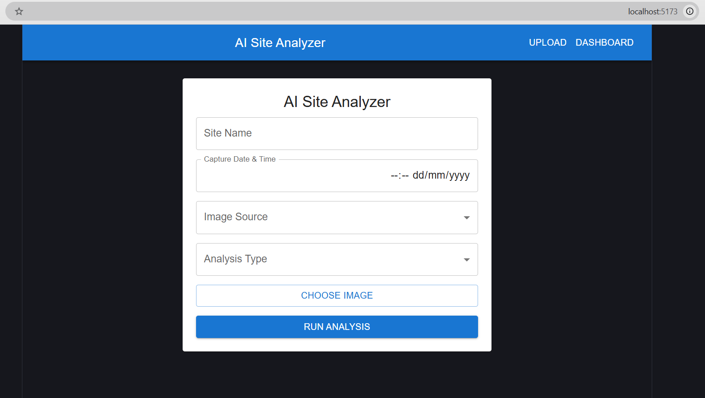
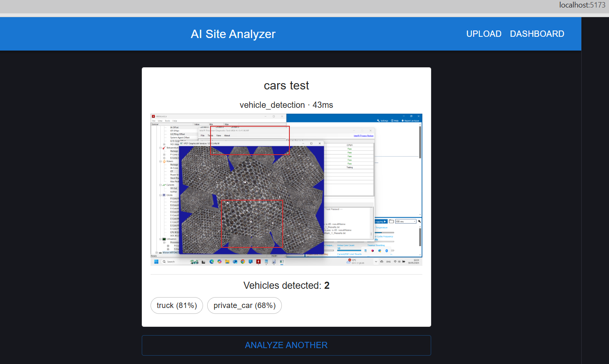
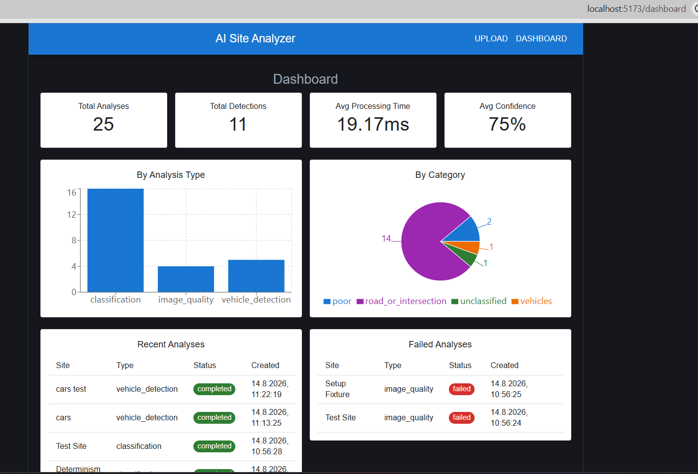
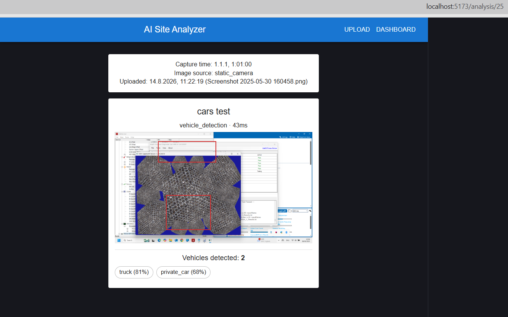

# AI Site Analyzer

A web product for uploading and analyzing site images (classification, vehicle
detection, image quality), paired with an agentic AI test suite that exercises
the product end-to-end and produces a QA report with fix recommendations.

- **Part A** — FastAPI backend + React frontend. Upload an image, run an
  analysis (a deterministic mock, except image quality which runs a real
  Laplacian-variance/brightness algorithm), view results on a dashboard.
- **Part B** — `agentic_tests/`, a suite of plain-Python agents (no
  LangGraph/CrewAI) that plans test cases, executes them against a live
  Part A instance (API calls + real browser via Playwright), validates the
  results, and generates a report with suggested fixes.

See [`docs/ARCHITECTURE.md`](docs/ARCHITECTURE.md) for the design decisions
behind both parts.

## Screenshots

**Part A** — upload, result, dashboard, and analysis detail (with the
vehicle-detection bounding box overlay):

<table>
<tr>
<td><br>Upload</td>
<td><br>Result (right after submitting)</td>
</tr>
<tr>
<td><br>Dashboard</td>
<td><br>Analysis detail</td>
</tr>
</table>

**Part B** — a full `run_agentic_tests.py` run and the resulting
`report.html`, including the `TC-029` failure card:

https://github.com/user-attachments/assets/ce9d086c-55bf-480b-af34-f9aa6e5f14d9

## Quick Start — Docker Compose

Requires Docker Desktop.

```powershell
docker compose up --build
```

- Backend: http://localhost:8000
- Frontend: http://localhost:5173

Analysis data persists in `backend/data/` (bind-mounted), so it survives
`docker compose down` / `up`. To stop: `docker compose down`.

The agentic test suite is **not** part of Docker Compose by design — it runs
on the host and targets a base URL from `.env`, so it can test a Dockerized
instance, a locally-run instance, or a deployed one, without rebuilding
anything.

## Manual Setup (for development)

### Backend

```powershell
cd backend
python -m venv .venv
.venv\Scripts\python.exe -m pip install -r requirements.txt
.venv\Scripts\python.exe -m uvicorn app.main:app --reload --port 8000
```

- API: http://localhost:8000
- Raw data (no UI needed): http://localhost:8000/api/analysis

Run backend unit tests:

```powershell
.venv\Scripts\python.exe -m pytest
```

Copy `backend/.env.example` to `backend/.env` if you need to override
`CORS_ORIGINS` or `DB_FILENAME` — the defaults already work out of the box.

### Frontend

```powershell
cd frontend
npm install
npm run dev
```

- App: http://localhost:5173

Copy `frontend/.env.example` to `frontend/.env` if the backend isn't at
`http://localhost:8000`.

### Agentic Test Suite

Has its own virtual environment and `requirements.txt`, separate from the
backend's. Requires the backend **and** frontend already running (previous
two sections).

```powershell
cd agentic_tests
python -m venv .venv
.venv\Scripts\python.exe -m pip install -r requirements.txt
.venv\Scripts\python.exe -m playwright install chromium
```

Copy `agentic_tests/.env.example` to `.env` if `BASE_URL`/`FRONTEND_URL`
differ from the defaults. `LLM_PROVIDER` is documented for a future
`GeminiLLMClient` adapter behind the same `LLMClient` interface — only
`MockLLMClient` is implemented today, so leave it at `mock`; setting it to
`gemini` currently has no effect.

Run the full suite:

```powershell
.venv\Scripts\python.exe run_agentic_tests.py
```

This generates test cases, runs all of them, and writes:

- `artifacts/test_cases.json` — the generated test plan
- `artifacts/report.json` — machine-readable results
- `artifacts/report.html` — self-contained report, open directly in a
  browser (double-click, or `start artifacts\report.html`)
- `artifacts/screenshots/` — evidence for failed/blocked UI tests only

Debug a single UI flow with a visible browser (useful when a selector
breaks and headless output alone doesn't explain why):

```powershell
.venv\Scripts\python.exe debug_ui.py open_dashboard
```

Available flows: `display_result`, `open_dashboard`,
`review_previous_analysis`, `dashboard_filters`.

To watch the browser during a *full* suite run instead of a single flow:

```powershell
$env:UI_HEADED = "1"
.venv\Scripts\python.exe run_agentic_tests.py
```

### Clearing the database

Several test cases (e.g. "dashboard with no data") assume an empty database
at the start of a run. If you've run the suite before without clearing state,
re-running it against leftover data will produce spurious failures. To reset:

```powershell
cd backend
Remove-Item data\analyzer.db -Force
Remove-Item data\uploads -Recurse -Force
```

Restart uvicorn afterward — tables are recreated automatically on startup
(no migrations; out of scope for this project).

## Frontend Routes

Declarative React Router (`<BrowserRouter>` + `<Routes>` + `<Route>`), all
paths are static string literals.

| Path             | Page                  | Purpose                                    |
| ---------------- | --------------------- | ------------------------------------------- |
| `/`               | `UploadPage`           | Upload an image and submit it for analysis  |
| `/dashboard`      | `DashboardPage`        | Aggregated stats, recent and failed analyses |
| `/analysis/:id`   | `AnalysisDetailsPage`  | Detail view of a single analysis result     |

## Agent Chain (Part B)

`run_agentic_tests.py` wires the agents together and drives the whole run.
Each agent has one responsibility and only sees what it needs — none of them
guesses a job that belongs to another.

1. **`TestPlannerAgent.generate_test_cases()`**
   Returns a list of 35 test case dicts (`id`, `name`, `category`, `priority`,
   `type`: `"api"`/`"ui"`, `steps` for humans, `action` for the executor).
   Test cases are derived from the spec/API contract, never from the app's
   own route code, so the suite can't accidentally validate against its own
   bugs.

2. **`Orchestrator.run(test_cases)`** — the loop, one test case at a time,
   each wrapped in its own `try/except` so one failure never blocks the rest.
   For each test case it calls the next three agents in order and assembles
   the final result record (`test_case_id`,
   `name`, `status`, `expected_result`, `actual_result`, `timestamp`,
   `duration_ms`, `error_message`, `screenshot`, `logs`, and — only on
   failure — `severity` + `suggested_fix`).

   a. **`ExecutionAgent.run(test_case)`** — dispatches to `ApiRunner` or
      `UiRunner` based on `action["type"]`. Returns raw execution data only
      (HTTP status/body, or UI state like `page_loaded=True`) — never a
      pass/fail verdict.

   b. **`ValidationAgent.validate(test_case, execution_result)`** — the only
      agent allowed to decide pass/fail. Compares `execution_result` against
      `test_case["action"]["expect"]` and returns `status`
      (`"passed"`/`"failed"`), `deviations` (list of mismatch strings), and
      human-readable `expected_result`/`actual_result` sentences generated
      from the comparison — no LLM involved, this is pure templating.

   c. **`FixRecommendationAgent.analyze(...)`** — called only when
      `validation_result["status"] == "failed"`. Returns `component`
      (rule-based, mapped from `test_case["category"]`/`type`), `severity`
      (= `test_case["priority"]`), `recommendation` and `regression_test`
      (both rule-based), and `cause` — the *only* field generated by
      `LLMClient.complete(...)`.

   The `Orchestrator` also owns UI screenshot lifecycle here: `UiRunner`
   always captures a screenshot unconditionally (it doesn't know the verdict
   yet); once `ValidationAgent` has ruled, the `Orchestrator` deletes it on a
   pass or renames it to `{test_id}_{status}.png` on a fail/block, so it's
   findable straight from the report.

3. **`ReportAgent.generate(results, coverage)`** — takes the full list of
   result records from `Orchestrator.run(...)` plus `planner.coverage_report(
   test_cases)` (category → test IDs, computed by the planner since it owns
   the test cases, not by the report agent). Returns one aggregated dict:
   totals, `pass_rate`, `failures` (filtered from `results`), `by_severity`/
   `by_component` tallies, `slowest` (top 5 by duration across *all*
   results), `coverage`, `known_limitations` (a fixed list), and `narrative`
   — the only other LLM-generated field, summarizing what the failures mean
   *together*. If the LLM call fails or returns nothing, `narrative` is
   simply `None` — the report stays valid either way.

   `to_json(report)` and `to_html(report)` both read this same dict, so the
   two output formats can never drift apart from each other.

## Known Limitations

- `TC-023` (timeout behavior) is permanently blocked — testing it properly
  needs a deliberately slow endpoint or fault injection, both out of scope.
- `TC-029` (dashboard filter/sort UI) is a known, real gap — the feature
  doesn't exist in the frontend yet.
- Two of the three analyzers (`classification`, `vehicle_detection`) are
  deterministic mocks, not real ML models, per the assignment's scope. Only
  `image_quality` runs a real algorithm.
- `cause` and `narrative` text are generated by `MockLLMClient` — the only
  `LLMClient` implementation that exists today. A real `GeminiLLMClient`
  adapter could be added behind the same interface without changing
  `FixRecommendationAgent` or `ReportAgent`, but it isn't built yet, and
  `LLM_PROVIDER` currently has no effect.
