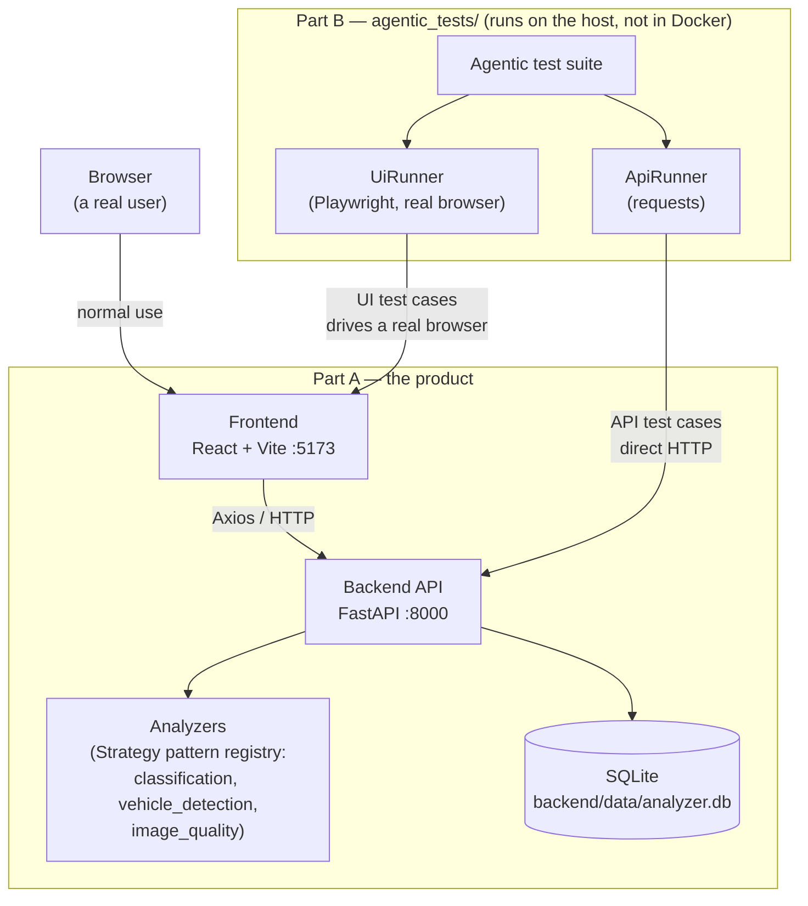
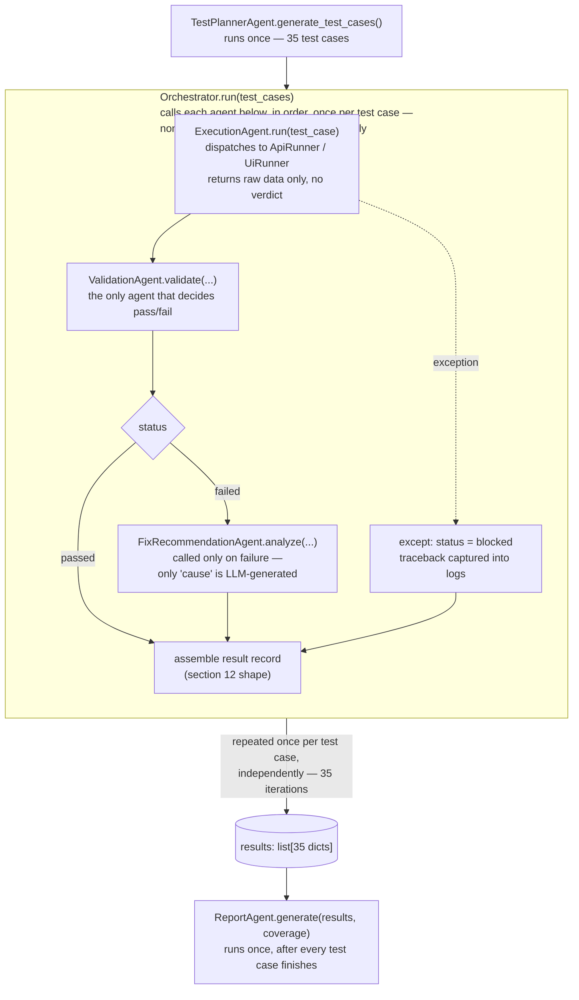

# Architecture

This document explains the design decisions behind AI Site Analyzer — the
*why*, not the *how to run* (see [`README.md`](../README.md) for that).

## Overview

The project is two separate programs, deliberately:

- **Part A** — the product itself. A FastAPI backend, a SQLite database, and
  a React frontend. Uploads an image, runs one of three analyzers against
  it, stores and displays the result.
- **Part B** — `agentic_tests/`, an independent verifier. It does not import
  or call into Part A's code. It only ever talks to Part A the way a real
  client would: HTTP requests to the API, and a real browser driving the
  frontend. This is what makes it a genuine test of the product rather than
  a test of the code that happens to sit next to it.

### System map



Two arrows reach Part A from outside: a real user through the browser, and
the agentic suite through two paths — a real (Playwright-driven) browser for
UI test cases, and direct HTTP for API test cases. Both paths are "external"
in the same sense a real user's traffic is; neither one imports Part A's
Python or JS source.

This is also why the suite runs on the host instead of joining
`docker-compose.yml`: it needs to be able to point at *any* running
instance of Part A — Dockerized, local, or deployed — without being rebuilt
alongside it.

## The Requirements-Driven Test Contract

This is the single strongest design decision in the project, and it applies
to every test case the suite generates, not just the API ones.

`agentic_tests/requirements_spec.py` hand-transcribes the API contract
directly from the assignment specification — endpoint, method, expected
status, required response fields — as plain data, independent of the
backend's own code:

```python
API_CONTRACT = [
    {
        "endpoint_id": "create-analysis",
        "method": "POST",
        "path": "/api/analysis",
        "description": "Create a new analysis from an uploaded image",
        "expected_status": 201,
        "required_response_fields": ["id", "status", "result"],
    },
    ...
]
```

`TestPlannerAgent` builds test cases from this file. It was never given the
option to build them from `backend/app/routes.py` instead.

**Why `app.routes` was rejected as a source.** A test system that derives
its expectations from the implementation it's testing only proves the code
equals itself. If a route handler had the wrong status code baked in, a
test generated *from that same handler* would expect the wrong code too,
and pass. The bug and the test that was supposed to catch it would agree
with each other perfectly — for the same reason, from the same mistake.
Deriving expectations from the specification instead means a bug in the
implementation actually has something independent to disagree with.

**A related but distinct import: `backend_link.py`.** This file *does*
import from `backend/app/` — but only configuration *vocabulary*, never
behavioral *expectations*: the literal set of valid `analysis_type`/
`image_source` values, the max upload size, the allowed content types. These
aren't claims about correct behavior, they're shared constants that would
otherwise have to be hand-copied as magic strings into the test suite —
`"classification"` typed out separately in two places is not more
independent than importing it, it's just a second place for the two to
silently drift apart. The rule isn't "never import from the backend"; it's
"never let the backend tell the tests what counts as correct." Contract
data (`API_CONTRACT`, and the fixture seeds discussed below) is always
hand-written from the spec. Vocabulary (enum values, limits) is shared, not
duplicated.

The operational test for which category something falls into: **if this
value were wrong, would a test still fail?** A wrong `ANALYSIS_TYPES` makes
the suite test a type that does not exist — it fails loudly. A wrong
expected status pulled from `app.routes` makes the test match the bug and
pass silently. Vocabulary can be shared. Expectations cannot.

## Alternatives Considered and Rejected

- **YOLO / a real ML model** — considered for `vehicle_detection`. Rejected:
  breaks `ValidationAgent`'s determinism requirement, and an opaque model
  can't be explained line-by-line live. Cost avoided: days of setup on a
  5-day assignment scored on architecture, not ML.

- **LangGraph / CrewAI** — considered for Part B's orchestration. Rejected:
  plain Python classes keep every agent's control flow readable directly in
  its source, nothing hidden in a graph runtime. Cost avoided: a framework's
  own abstractions becoming a second thing to defend in the interview.

- **`StaticFiles` mount on the uploads directory** — considered for serving
  analysis images. Rejected: it turns the URL path into client-supplied
  input against the filesystem — every file in the directory becomes
  reachable by guessing a name, with no link to a database row and no way
  to distinguish a completed analysis from a failed or orphaned upload.
  Instead, `GET /api/analysis/{id}/image` resolves the file through the
  database — the id is validated, the row is checked, and the filename
  never crosses the API boundary; `stored_filename` stays internal. Cost avoided: an endpoint whose surface is "whatever
  happens to be on disk" rather than "images belonging to a known analysis."

- **SQLAlchemy `Enum` columns** — considered for `analysis_type`/
  `image_source`/`status`. Rejected: bakes a CHECK constraint into the
  schema; changing allowed values needs a migration, and Alembic is out of
  scope. Cost avoided: schema churn; plain strings + Pydantic `Literal`
  give the same 422 at the API boundary instead.

- **Splitting `POST /api/analysis` into two steps for testability** —
  considered so a decode failure could be injected between upload and
  analyze. Rejected: shaping a production endpoint around a test's
  convenience is exactly the "magic" ruled out by design. Cost avoided: a
  fake API shape; TC-024 instead exploits a real gap — `Image.verify()`
  passes a truncated file that a full decode later rejects.

- **JS-computed bounding box scaling** — considered: backend returns pixel
  coordinates, frontend recomputes on image load/resize. Rejected: extra
  JS state for something CSS already does. Cost avoided: a class of
  resize/reflow bugs; backend returns 0–1 normalized coordinates, frontend
  positions boxes with plain CSS `%`, correct at any size for free.

## Agent Workflow



The loop's defining property is in the `except` branch: a crash inside
`ExecutionAgent` or `ValidationAgent` for one test case is caught locally,
recorded as `"blocked"` with the traceback as evidence, and the loop moves
on — it never reaches `FixRecommendationAgent` (there's no validated
failure to diagnose) but it also never takes down the remaining 34 test
cases. `ReportAgent` only runs once, after the full `results` list exists —
it has no per-test-case involvement.
